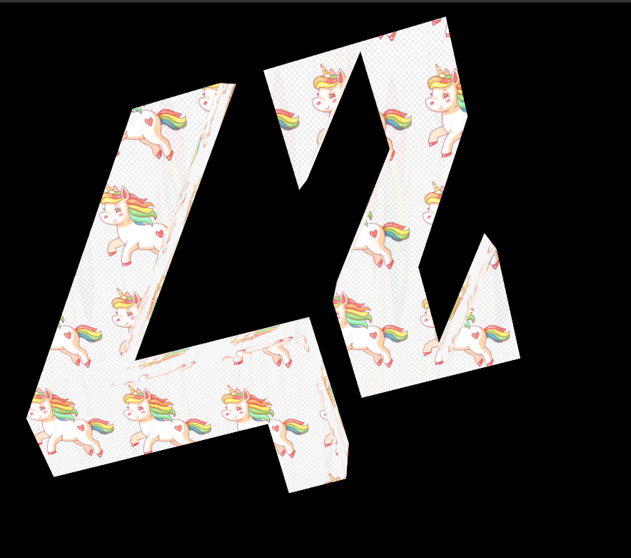
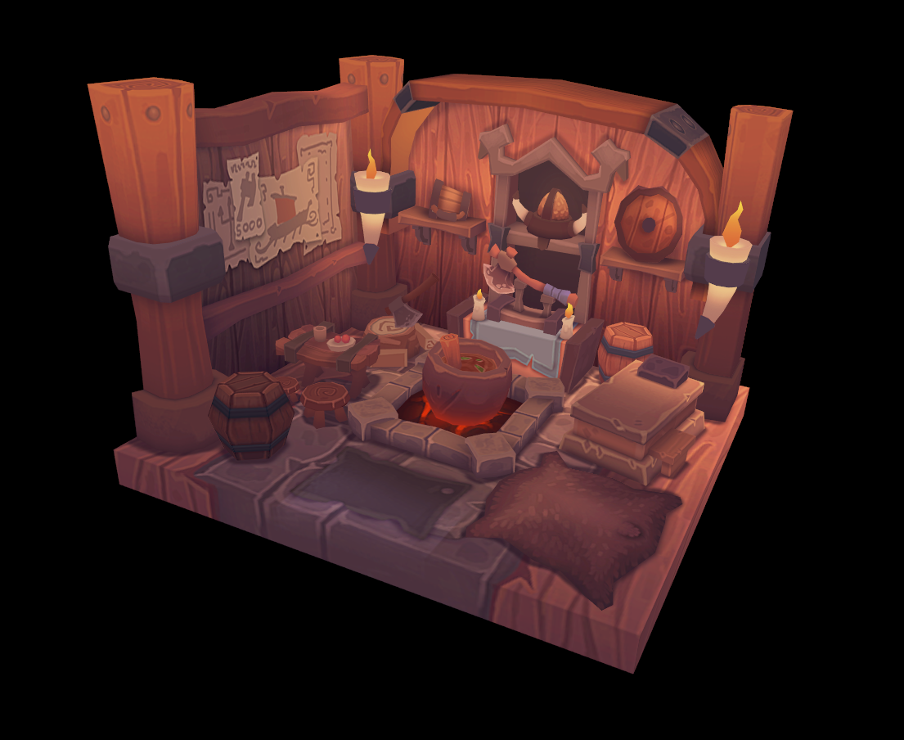

# ft_scop
Basic GPU rendering with Vulkan

Graphic rendering with: Vulkan
Base code: C++

What you need to do
--
Your goal is to create a small program that will show a 3D object conceived with a modelization program like Blender. The 3D object is stored in a .obj file. You will be at least
in charge of parsing to obtain the requested rendering.
In a window, your 3D object will be displayed in perspective (which means that what
is far must be smaller), rotate on itself around its main symmetrical axis (middle of the
object basically...). By using various colors, it must be possible to distinguish the various
sides.
Finally, a texture must be applicable simply on the object when we press a dedicated
key, and the same key allows us to go back to the different colors. A soft transition
between the two is requested.

Resources are available on the project page on 42 intra

To compile
--
check installs:

- https://vulkan-tutorial.com/fr/Environnement_de_developpement#page_Paquets-Vulkan

- glslc:
	https://github.com/google/shaderc/blob/main/downloads.md
	- take GCC
	- put bin and add PATH

- if glm is missing:
	https://glm.g-truc.net/0.9.6/index.html
	puis rajouter dans le makefile -I/PATH/glm

Controls
--
- object:
	- 1, 2, 3 -> rotate the object
	- 4 -> reset
	- p -> pause
- camera:
	- a -> slide to the left
	- d -> slide to the right
	- w -> go forward
	- s -> go backward
	- q -> down
	- e -> up
	- r -> reset
	- arrows -> rotate
- Texture:
	- c -> show Texture / Color
	- t -> change Texture (set in a directory)

Examples
--

